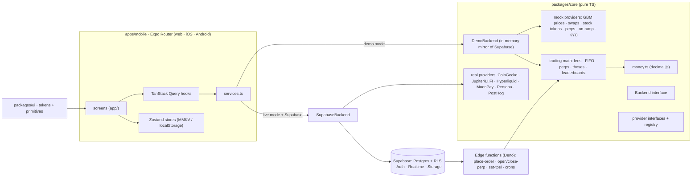

# hopium.family

**stay high on conviction.** A social-first trading app for crypto, stock tokens and perpetual futures. One Expo codebase ships web, iOS and Android.

> Runs fully in **demo mode** by default. Every balance, price, trade and deposit is simulated. No keys, no real money.

- Live demo (web): https://hopium-family.vercel.app · https://hopium-family.netlify.app
- Stack: Expo SDK 57 · React Native 0.86 · Expo Router · TypeScript strict · NativeWind 4 · TanStack Query 5 · Zustand · zod · decimal.js · Supabase

## Contents

1. [Screenshots to capture](#screenshots-to-capture)
2. [Architecture](#architecture)
3. [Prerequisites](#prerequisites)
4. [Quick start (demo mode)](#quick-start-demo-mode)
5. [Scripts](#scripts)
6. [Connecting a real Supabase project](#connecting-a-real-supabase-project)
7. [Switching providers from mock to real](#switching-providers-from-mock-to-real)
8. [Environment variables](#environment-variables)
9. [Building with EAS](#building-with-eas) · [Submitting to stores](#submitting-to-stores) · [Deploying web](#deploying-web)
10. [Release checklist](#release-checklist)
11. [Troubleshooting](#troubleshooting)
12. [Known limitations](#known-limitations)

## Screenshots to capture

Capture these at 390×844 (mobile) and 1440×900 (desktop web) for store listings and docs:

| Screen | Route | What to show |
|---|---|---|
| Welcome | `/welcome` | floating capsules, value cards, sign-in buttons |
| Home feed | `/` | "legends are buying" strip, trade + thesis cards, new-posts pill |
| Copy trade | tap **copy** on a feed trade | entry vs. price now, disclaimer, live quote |
| Asset detail | `/asset/HOPE` | live price flash, chart, your position, buy/sell bar |
| Stock token | `/asset/AAPLx` | 24/7 badge, tokenized-exposure explainer |
| Perps | `/perps/btc-perp` | leverage slider, estimated liquidation price, TP/SL, risk banner |
| Leaderboard | `/leaderboard` | season banner, podium, pinned "your rank" |
| Profile | `/profile` | stats row, portfolio chart, badges |
| Wallet | `/wallet` | balance donut, holdings, deposit/receive/withdraw |
| Desktop | any, ≥1280px | sidebar · feed · right rail |

## Architecture



- `packages/core` is framework-free TypeScript. The same trading math runs in the app, in `DemoBackend` and in the Deno edge functions, so client and server validate with identical rules.
- `DemoBackend` implements every endpoint in memory, including RLS-equivalent visibility rules, triggers (holdings, auto-posts, follower fan-out, counters) and the cron jobs (thesis resolution, price alerts, liquidation watch, leaderboards). It persists to device storage.
- Money is never floating point. All amounts are decimal strings computed with `decimal.js`, and stored as `numeric(38,18)` in Postgres.

```
hopium-family/
├─ apps/mobile/          Expo app — app/ (routes), src/ (components, hooks, providers, stores, lib, i18n), assets/
├─ packages/core/        types, zod schemas, money + trading math, providers, DemoBackend (+ tests)
├─ packages/ui/          design tokens, theme, primitives, brand geometry
├─ supabase/             migrations (schema, RLS, triggers, RPCs, cron), seed.sql, edge functions (+ Deno tests)
├─ scripts/              generate-icons.ts, seed-demo.ts, build-legal.ts, serve-dist.js, postexport.js
├─ e2e/                  playwright (web) + maestro (mobile)
└─ .github/workflows/    ci.yml, eas-preview.yml
```

## Prerequisites

- Node.js ≥ 20.19 (22 LTS recommended) and npm 10
- For iOS: Xcode 16+ and a simulator. For Android: Android Studio with an emulator.
- Optional: [Supabase CLI](https://supabase.com/docs/guides/cli), [EAS CLI](https://docs.expo.dev/eas/) (`npx eas-cli@latest`), [Maestro](https://maestro.mobile.dev)

## Quick start (demo mode)

```bash
npm install
npm run web        # http://localhost:8081
npm run ios        # iOS simulator (development build recommended)
npm run android    # Android emulator
```

Sign in with any email. In demo mode **any 6-digit code works**. You start with **$10,000 demo USDC** plus a couple of small bags, and 50 simulated traders keep the feed moving.

> Native modules (MMKV, camera, biometrics, notifications) need a development build: `npx expo run:ios` or `eas build --profile development`. In Expo Go the app falls back to in-memory storage.

## Scripts

| Command | What it does |
|---|---|
| `npm run typecheck` | `tsc --noEmit` for core, ui and the app |
| `npm run lint` | ESLint (flat config, React Compiler rules, no `any` / `console.log` / TODO) |
| `npm test` | Jest: core math, providers, DemoBackend, i18n parity, banned phrases, legal sync, components |
| `npm run test:coverage` | Jest with coverage (trading math threshold ≥ 95%) |
| `npm run test:functions` | Deno tests for the edge functions |
| `npm run e2e:web` | Playwright happy path on mobile + desktop web (run `npm run export:web` first) |
| `npm run e2e:mobile` | Maestro flow (requires a running simulator/emulator build) |
| `npm run export:web` | Static SPA export to `apps/mobile/dist`, plus prerendered share pages and OG cards (`scripts/prerender-web.ts`; set `SITE_URL` for non-production hosts) |
| `npm run icons` | Regenerate logo SVGs, app icons, splash, favicon and OG image |
| `npm run legal` | Compile `assets/legal/*.md` into `src/legal/content.ts` |
| `npm run seed:sql` | Regenerate `supabase/seed.sql` from the demo world |
| `npm run doctor` | `expo-doctor` |

## Connecting a real Supabase project

```bash
supabase start                              # local stack (Docker)
supabase db reset                           # applies migrations + seed.sql (50 demo traders)
supabase functions serve --env-file .env    # local edge functions
```

For a hosted project:

1. `supabase link --project-ref <ref>` then `supabase db push`.
2. Deploy functions: `supabase functions deploy` (deploys every folder under `supabase/functions`).
3. Set server secrets: `supabase secrets set SUPABASE_SERVICE_ROLE_KEY=… ONRAMP_SECRET_KEY=… KYC_API_KEY=… EXPO_ACCESS_TOKEN=…`
4. Enable cron: in the SQL editor, store `project_url` and `service_role_key` in Vault (see `migrations/0005_cron.sql`). This schedules resolve-theses (5 min), compute-leaderboards (hourly), check-price-alerts and liquidation-watch (every minute).
5. In `.env`, set `EXPO_PUBLIC_APP_MODE=live`, `EXPO_PUBLIC_SUPABASE_URL` and `EXPO_PUBLIC_SUPABASE_ANON_KEY`.

With a Supabase URL configured in live mode, the app uses `SupabaseBackend` (auth, tables, RPCs, Realtime and edge functions) instead of `DemoBackend`.

## Switching providers from mock to real

Every integration sits behind an interface in `packages/core/src/providers/interfaces.ts`, and `registry.ts` chooses the implementation. **Demo mode always forces mocks.** In live mode, each flag picks the real class:

| Provider | Flag | Real implementation | Needs |
|---|---|---|---|
| Wallet | `EXPO_PUBLIC_WALLET_PROVIDER=privy\|dynamic\|turnkey` | `RealWalletProvider` → register the SDK adapter with `registerWalletAdapter()` | `EXPO_PUBLIC_WALLET_APP_ID` |
| Market data | `EXPO_PUBLIC_MARKETDATA_PROVIDER=coingecko` | `CoinGeckoMarketData` | optional `EXPO_PUBLIC_COINGECKO_KEY` |
| Swaps | `EXPO_PUBLIC_SWAP_PROVIDER=jupiter-lifi` | `RealSwapProvider` (Jupiter on Solana, LI.FI on EVM) | wallet adapter |
| Stock tokens | `EXPO_PUBLIC_STOCKTOKEN_PROVIDER=robinhood` | `RealStockTokenProvider` | `EXPO_PUBLIC_STOCKTOKEN_API_URL` |
| Perps | `EXPO_PUBLIC_PERPS_PROVIDER=hyperliquid` | `HyperliquidPerps` (reads public API; orders via `open-perp`) | `EXPO_PUBLIC_PERPS_EXCHANGE_URL` |
| On-ramp | `EXPO_PUBLIC_ONRAMP_PROVIDER=moonpay` | `MoonPayOnramp` (URL signed by `onramp-sign-url`) | `EXPO_PUBLIC_ONRAMP_KEY` + server `ONRAMP_SECRET_KEY` |
| KYC | `EXPO_PUBLIC_KYC_PROVIDER=persona` | `HostedKycProvider` → `kyc` edge function | server `KYC_API_KEY`, `KYC_TEMPLATE_ID` |
| Analytics | set `EXPO_PUBLIC_POSTHOG_KEY` | `PostHogAnalytics` | — |
| Errors | set `EXPO_PUBLIC_SENTRY_DSN` | `@sentry/react-native` plugin enabled | `SENTRY_ORG`, `SENTRY_PROJECT` at build time |

A real provider with missing configuration throws a clear `ProviderNotConfiguredError` that names the missing variables. It never fails silently.

## Environment variables

Copy `.env.example` to `.env`. **Only `EXPO_PUBLIC_*` values reach the client bundle. Never put secrets there.**

| Variable | Scope | Purpose |
|---|---|---|
| `EXPO_PUBLIC_APP_MODE` | client | `demo` (default) or `live` |
| `EXPO_PUBLIC_SUPABASE_URL`, `EXPO_PUBLIC_SUPABASE_ANON_KEY` | client | Supabase project (anon key is RLS-protected) |
| `EXPO_PUBLIC_*_PROVIDER` | client | provider selection (see above) |
| `EXPO_PUBLIC_WALLET_APP_ID`, `EXPO_PUBLIC_ONRAMP_KEY`, `EXPO_PUBLIC_COINGECKO_KEY` | client | publishable keys only |
| `EXPO_PUBLIC_SENTRY_DSN`, `EXPO_PUBLIC_POSTHOG_KEY` | client | observability (optional) |
| `EAS_PROJECT_ID` | build | EAS project + OTA updates |
| `SUPABASE_SERVICE_ROLE_KEY` | server | edge functions only |
| `ONRAMP_PUBLISHABLE_KEY`, `ONRAMP_SECRET_KEY` | server | MoonPay URL signing |
| `KYC_API_KEY`, `KYC_TEMPLATE_ID` | server | Persona inquiries |
| `COINGECKO_API_KEY`, `PERPS_API_KEY` | server | cron price feeds, perps agent |
| `EXPO_ACCESS_TOKEN` | server | Expo push API |

## Building with EAS

```bash
cd apps/mobile
npx eas-cli@latest init                     # sets EAS_PROJECT_ID
npx eas-cli@latest build --profile development --platform ios
npx eas-cli@latest build --profile preview --platform android   # installable APK
npx eas-cli@latest build --profile production --platform all
npx eas-cli@latest update --channel preview --message "…"       # OTA update
```

Profiles live in `apps/mobile/eas.json`. Production builds auto-increment build numbers and default to `EXPO_PUBLIC_APP_MODE=live`. CI can trigger preview builds from **Actions → EAS preview build**.

## Submitting to stores

```bash
npx eas-cli@latest submit --profile production --platform ios
npx eas-cli@latest submit --profile production --platform android
```

Store notes: account deletion is in-app (Settings → delete account). Sign in with Apple is offered alongside Google on iOS. Crypto purchases don't use in-app purchases. Permission strings for camera, Face ID and photo library are set in `app.config.ts`. Replace `TEAMID` in `public/.well-known/apple-app-site-association` and the SHA-256 in `assetlinks.json` before shipping universal links.

## Deploying web

The export is a single-page app (`web.output: "single"`), because routing and state are client-side.

- **Vercel:** `vercel.json` sets the build command, output dir, SPA rewrites, CSP and security headers, immutable caching and `.well-known` content types. Connect the repo, or run `vercel deploy --prod`.
- **Netlify:** `netlify.toml` does the same (`/* → /index.html 200`). Connect the repo, or run `netlify deploy --prod --dir apps/mobile/dist`.

## Release checklist

- [ ] Legal review of `apps/mobile/assets/legal/*` (EN + ID are **drafts**), then `npm run legal`
- [ ] Confirm `region_rules` per launch country (stock tokens, perps, copy trading, KYC-required features)
- [ ] Choose and contract the KYC provider; wire its webhook to update `profiles.kyc_status`
- [ ] Contract the on-ramp, wallet, perps and stock-token providers; set keys; run live smoke tests on testnets or with small amounts
- [ ] Set `app_config` fees, minimums and tier thresholds
- [ ] Replace universal-link placeholders (Team ID, Android cert SHA-256)
- [ ] Enable Sentry and PostHog; verify no PII in events
- [ ] Store review notes: demo credentials (any email + any 6-digit code in demo builds), explain tokenized exposure and region gating
- [ ] Penetration test and RLS review (see `supabase/migrations/0002_policies.sql`)

## Troubleshooting

| Symptom | Fix |
|---|---|
| Metro "Unable to resolve module" after installing deps | `npx expo start --clear` |
| Two copies of React / "Invalid hook call" | React is pinned to 19.2.3 via root `overrides`; run `rm -rf node_modules package-lock.json && npm install` |
| Typed routes out of date (`Href` errors) | start Metro once (`npm run web`) to regenerate `.expo/types` |
| Styles missing after editing `tailwind.config.js` | restart Metro with `--clear` |
| Crash on MMKV / NitroModules in Expo Go | use a development build; the app falls back to memory storage |
| Web shows old build | the SPA is cached aggressively; hard refresh, or bump the deployment |
| Jest hangs on native modules | mocks live in `apps/mobile/jest.setup.ts` (Reanimated, worklets, bottom-sheet, MMKV) |

## Known limitations

- **Demo only for money movement.** Real providers are implemented for read paths and wired through edge functions for writes, but they need contracts, keys and legal sign-off before handling funds.
- Wallet SDKs (Privy/Dynamic/Turnkey) are React-bound. Register an adapter from the SDK's provider tree; this isn't bundled.
- Stock-token venue API is a documented REST contract (`RealStockTokenProvider`); adapt it to the venue you choose.
- Candles and prices in demo mode are simulated (seeded GBM) and deterministic per seed.
- The web build is a client-rendered SPA. Share pages with their own title and OG card are prerendered at build time for every catalog asset, perp market, demo trader and seeded thesis; profiles and theses created after the build fall back to the default card for crawlers.
- iOS/Android were verified through TypeScript, Jest (jest-expo) and expo-doctor in this environment. Run the Maestro flow on a simulator build before release.
